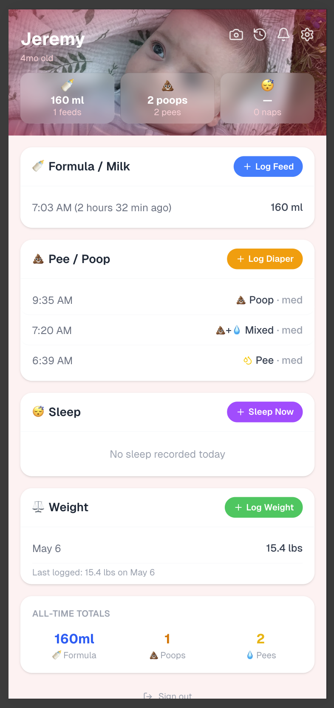

# TinyTrackerIO

TinyTrackerIO is a mobile-first baby tracking app for shared caregivers.

Track feedings, diapers, sleep, and weight with a fast one-tap workflow, real-time updates, and Alexa voice logging.

## Dashboard



## Current Features

- Shared caregiver model ("The Village") with owner/caregiver roles
- Feedings, diapers, sleeps, and weight tracking
- Day view and history view with edit/delete support
- Live updates + resume refresh when returning to the app
- Push notifications between caregivers (home-screen app / PWA)
- Alexa custom skill integration for hands-free logging
- Invite links for adding caregivers
- Baby profile photo uploads
- CSV/JSON data export

## Tech Stack

- Next.js App Router + TypeScript
- Supabase (Postgres, Auth, Storage, RLS)
- Tailwind CSS
- Vercel deployment

## Local Development

1. Install dependencies:

```bash
npm install
```

2. Create `.env.local` with your project variables:

```bash
NEXT_PUBLIC_SUPABASE_URL=...
NEXT_PUBLIC_SUPABASE_ANON_KEY=...
SUPABASE_SERVICE_ROLE_KEY=...

# Alexa (optional)
ALEXA_SKILL_ID=...
ALEXA_USER_ID=...
ALEXA_BABY_ID=...

# Web Push (optional)
NEXT_PUBLIC_VAPID_PUBLIC_KEY=...
VAPID_PRIVATE_KEY=...
```

3. Run the app:

```bash
npm run dev
```

Open http://localhost:3000

## Supabase Notes

- RLS policies are enabled across core tables.
- `push_subscriptions` is used for caregiver push fan-out.
- Storage bucket `baby-photos` is used for banner/profile images.

## Deployment

Production is deployed on Vercel.

Typical deploy command:

```bash
npx vercel@latest --prod --yes
```

## Alexa Integration

The Alexa skill posts to:

- `/api/alexa`

Supported intents include diaper, feeding, and sleep logging.

## License

Private project.
